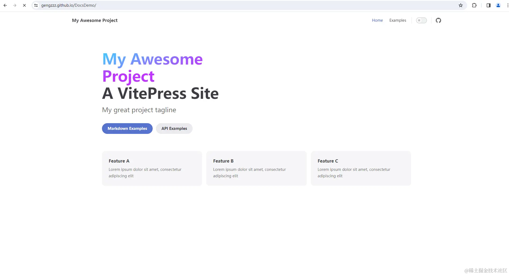

> 作者：GengZzz               
> 链接：https://juejin.cn/post/7340127788052840485?searchId=20240624094101A0207665A20F980BB734             
> 来源：稀土掘金                  
> 著作权归作者所有。商业转载请联系作者获得授权，非商业转载请注明出处。

---------

* 主要阐述vitepres项目部署到`GitHub Pages`
* 不阐述vitepess细节技术使用，详细使用可详见[vitepress中文官网](https://link.juejin.cn?target=https%3A%2F%2Fvitepress.dev%2Fzh%2F "https://vitepress.dev/zh/")
* 包含细节`踩坑`，如遇`GitHub`部署问题，可放心食用
* 通过Github Actions 直接推送`自动更新`
* 如想保姆级别的Vitepress教程博客，可查看该博主的[博客](https://link.juejin.cn?target=https%3A%2F%2Fdocs.bugdesigner.cn%2Fdocs%2FTutorial%2Fvitepress.html "https://docs.bugdesigner.cn/docs/Tutorial/vitepress.html")

### 创建vitepress项目

* **步骤一**

```sh
shnpm add -D vitepress
```

* **步骤二**

> 步骤二中采用vitepress命令式创建项目时，会提示是否在根路径下直接创建，建议在当前项目中`./docs`目录中创建

```sh
sh┌  Welcome to VitePress!
│
◆  Where should VitePress initialize the config?
│  ./_
└
```

* UP使用vitepress命令式创建项目具体流程如下，其中**项目名称**为`DocsDemo`,**Theme**建议选择`第二个`，Vitepress官网目前用的也是这个，简洁美观,是否使用**Typescript**根据个人喜好

```sh
sh┌  Welcome to VitePress!
│
◇  Where should VitePress initialize the config?
│  ./docs
│
◇  Site title:
│  My Awesome Project
│
◇  Site description:
│  A VitePress Site
│
◇  Theme:
│  Default Theme + Customization
│
◇  Use TypeScript for config and theme files?
│  Yes
│
◇  Add VitePress npm scripts to package.json?
│  Yes
│
└  Done! Now run npm run docs:dev and start writing.
```

### 推送项目到GitHub

### Github中创建项目

在Github中创建开源项目,名称与本地项目同名，步骤如下

> 项目类型选择 `Public`

 

### 本地项目推送到Github

1. 修改`config.mts`中`base`配置信息

```ts
tsbase:"/DocsDemo/",
```

2. 初始化本地git仓库

```sh
shgit init
```

3. 添加.gitignore文件

```sh
shnode_modules
.DS_Store
dist
dist-ssr
cache
.cache
.temp
*.local
```

4. 添加文件到暂存区

```sh
shgit add .
```

5. 提交到仓库

```sh
shgit commit -m 'item init'
```

6. 添加远程仓库到本地

```sh
shgit remote add origin git@github.com:GengZzz/DocsDemo.git
```

7. 执行项目推送

```sh
shgit push -u origin master
```

> 此处分支branch一定要设置为`master`

### 自动部署

1. GitHub设置Actions


2. 添加`deploy.yml`文件

* 官方文档中配置需要根据自己使用的`包管理工具`进行修改比如`npm`、`yarn`、`bun`、`pnpm`等
* 官方文档中`deploy.yml`配置信息中`branches: [main]`改为`branches: [master]`
* 修改为自己的`Node`版本

```yml
yml- name: Setup Node
        uses: actions/setup-node@v4
        with:
          node-version: 18  
          cache: npm # 或 pnpm / yarn
```

* 如果项目中的根目录不是`./docs`，此处注意修改

```yml
yml- name: Upload artifact
        uses: actions/upload-pages-artifact@v3
        with:
          path: docs/.vitepress/dist 
```

* 该段中`touch docs/.vitepress/dist/.nojekyll`一定不能省略，关系到部署成功后`样式`是否`生效`

```yml
yml- name: Build with VitePress
        run: |
          npm run docs:build # 或 pnpm docs:build / yarn docs:build / bun run docs:build
          touch docs/.vitepress/dist/.nojekyll 

```

> 配置文件信息，`UP使用的是npm`可详见[Vitepress官网`deploy.yml`信息](https://link.juejin.cn?target=https%3A%2F%2Fvitepress.dev%2Fzh%2Fguide%2Fdeploy%23github-pages "https://vitepress.dev/zh/guide/deploy#github-pages")

```yml
yml# 构建 VitePress 站点并将其部署到 GitHub Pages 的示例工作流程
#
name: Deploy VitePress site to Pages

on:
  # 在针对 `main` 分支的推送上运行。如果你
  # 使用 `master` 分支作为默认分支，请将其更改为 `master`
  push:
    branches: [master]

  # 允许你从 Actions 选项卡手动运行此工作流程
  # workflow_dispatch:

# 设置 GITHUB_TOKEN 的权限，以允许部署到 GitHub Pages
permissions:
  contents: read
  pages: write
  id-token: write

# 只允许同时进行一次部署，跳过正在运行和最新队列之间的运行队列
# 但是，不要取消正在进行的运行，因为我们希望允许这些生产部署完成
concurrency:
  group: pages
  cancel-in-progress: false

jobs:
  # 构建工作
  build:
    runs-on: ubuntu-latest
    steps:
      - name: Checkout
        uses: actions/checkout@v4
        with:
          fetch-depth: 0 # 如果未启用 lastUpdated，则不需要
      # - uses: pnpm/action-setup@v2 # 如果使用 pnpm，请取消注释
      # - uses: oven-sh/setup-bun@v1 # 如果使用 Bun，请取消注释
      - name: Setup Node
        uses: actions/setup-node@v4
        with:
          node-version: 18
          cache: npm # 或 pnpm / yarn
      - name: Setup Pages
        uses: actions/configure-pages@v4
      - name: Install dependencies
        run: npm ci # 或 pnpm install / yarn install / bun install
      - name: Build with VitePress
        run: |
          npm run docs:build # 或 pnpm docs:build / yarn docs:build / bun run docs:build
          touch docs/.vitepress/dist/.nojekyll
      - name: Upload artifact
        uses: actions/upload-pages-artifact@v3
        with:
          path: docs/.vitepress/dist

  # 部署工作
  deploy:
    environment:
      name: github-pages
      url: ${{ steps.deployment.outputs.page_url }}
    needs: build
    runs-on: ubuntu-latest
    name: Deploy
    steps:
      - name: Deploy to GitHub Pages
        id: deployment
        uses: actions/deploy-pages@v4
```

* GitHub中添加deploy.yml以及提交


* 查看workflows执行状态,执行结束后会看到图标显示为`绿色`


* 查看部署后的文档访问地址,点击地址便可以看到不出成功后的路由地址，访问地址便能成功看到部署成功以后的vitepress文档

